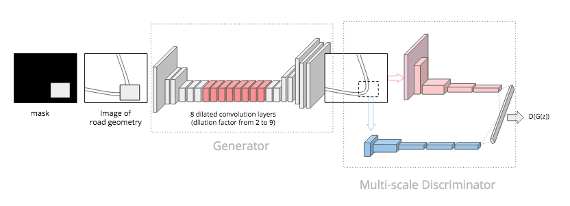

## Correcting Faulty Road Maps by image inpainting

As maintaining road networks is labor-intensive, many au-
tomatic road extraction approaches have been introduced to
solve this real-world problem, fueled by the abundance of
large-scale high-resolution satellite imagery and advances in
computer vision. However, their performance is limited for
fully automating the road map extraction in real-world ser-
vices. Hence, many services employ the two-step human-in-
the-loop system to post-process the extracted road maps: er-
ror localization and automatic mending for faulty road maps.
Our paper exclusively focuses on the latter step, introduc-
ing a novel image inpainting approach for fixing road maps
with complex road geometries without custom-made heuris-
tics, yielding a method that is readily applicable to any road
geometry extraction model. We demonstrate the effectiveness
of our method on various real-world road geometries, such as
straight and curvy roads, T-junctions, and intersections.

## Globally Locally Consistent Roadmap Correction (CLCRC) model architecture 




## Inpainting results on faulty road segments 


## Inpainting results comparison 

We conduct quantitative and qualitative analysis on whether the modifications are effective. We
use three metrics, Correctness, Completeness, and Quality,
which are widely used in road extraction tasks We choose four random road maps per
each road type: Straight, Curvy, T-junction, and Intersection,
where the latter three types are known to be challenging for
existing post-processing methods. 
Table 1 shows the performance impact on various modifications: GLCRC being the architectural and GLCRC+L being the training loss modifications. We can clearly observe
that our approach shows the best image quality in the road ge-
ometry inpainting problem. Furthermore, Figure 1 shows the
effectiveness of our method on various road types, implying that it understands underlying road geometries to reconstruct
the road location.


## Baseline model
The baseline model is GLCIC (GLobally Locally Consistent Image Completion). The paper and source code are in following URL. 
http://iizuka.cs.tsukuba.ac.jp/projects/completion/data/completion_sig2017.pdf


## Experiment models 
Based on the baseline model (GLCIC), several experiments have been conducted. The summary of these experiments are written in confluence page.
https://confluence.in.here.com/pages/viewpage.action?pageId=1135190018


## Hyperparameters
Since there are many experiments conducted and each experiment has different target to achieve. Therefore, before running the experiment, following features of the model need to be double checked in the parameter setting code.

1. Parallel traininig using multiple GPU
   
```parser.add_argument('--data_parallel', action='store_true', default=False) ```


2. Save model parameter and optimizer for future training resume in designated path
 ```
parser.add_argument('--init_model_cn', type=str, default=None) #default='/home/shong/<path>'
parser.add_argument('--init_model_cd', type=str, default=None) #default='/home/shong/<path>'
parser.add_argument('--init_opt_cn', type=str, default=None) #default='/home/shong/<path>'
parser.add_argument('--init_opt_cd', type=str, default=None) #default='/home/shong/<path>'
parser.add_argument('--resume_step', type=int, default=None) #default=4) # resume_step should be the last saved step
 ```

3. Batch size
   
 ```parser.add_argument('--bsize', type=int, default=1) ```


4. loss function 
In case the experiment is conducting using different loss function, please double check the used loss function in completion network and context discriminator


5. In case, resuming the training with previously trained model, check Optimizer is loaded and move to GPU correctly
  
## Dependencies
  requirements.txt
   ```
    Python: 3.7.6
    torch: 1.9.0 (cuda 11.1)
    torchvision: 0.10.0
    tqdm: 4.61.1
    Pillow: 8.2.0
    opencv-python: 4.5.2.54
    numpy: 1.19.2
    GPU: Geforce GTX 1080Ti (12GB RAM) X 4
 ```
  
## Train 
  
  1. Download data
  
  2. Since we need only geometry images (black road geometry line in white background), get only *_mask.png files and convert to 'black road geometry line in white background' image. For this task, you can use /util/deep_globe_data_prep.py 
  
  3. Put train data into <your_path>/data
  
  4. The data folder should have 'train', 'val', 'test' subfolders
  
  5. Train 
  
  To train the vanila model, 
  
    python train.py <your_path>/data ./result
  
  To train with deep dilated convolution architecture model, 
  
    python train_with_deep_dual_conv.py <your_path>/data ./result
  
  To model with adapted loss functions (for better image quality)
  
    python train_with_various_loss.py <your_path>/data ./result
 
  
# Inference
  
  ```python predict.py model_cn config.json images/test_2.jpg test_2_out.jpg```

